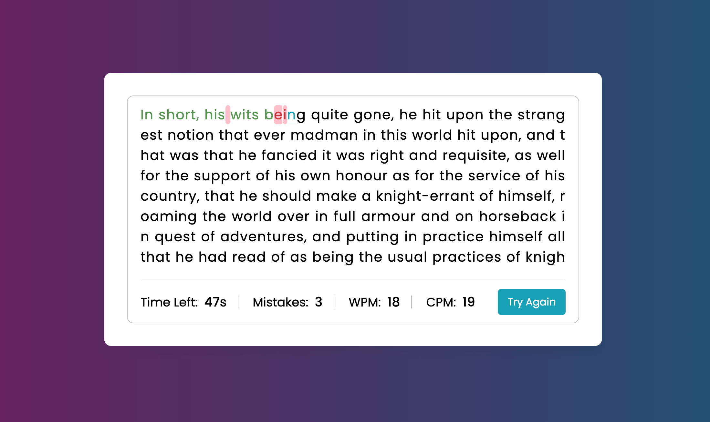

# Typing Speed Test



A simple, responsive typing speed test built with HTML, CSS, and vanilla JavaScript.
It measures: 

- WPM (Words Per Minute)
- CPM (Characters Per Minute)
- Mistakes
- Time remaining

Each test uses a randomly selected paragraph from public domain classic novels.

## Features

- **Random paragraphs**  
  On each run, a random paragraph is loaded from a predefined list of public-domain texts.

- **Live stats**  
  - WPM is calculated in real time  
  - CPM updates as you type  
  - Mistakes are tracked and displayed  
  - Countdown timer (default: 60 seconds)

- **Per-character feedback**  
  - Correct characters are highlighted in green  
  - Incorrect characters are highlighted in red with a subtle background  
  - The current character is highlighted with an animated "cursor" underline

- **Keyboard-only friendly**  
  The actual input field is hidden, and focus is managed so the user can just start typing without clicking into a text box.

- **Responsive layout**  
  The UI adapts down to smaller screens, adjusting font sizes and layout for mobile.

- **No dependencies**  
  Pure HTML/CSS/JS - no frameworks, no build step.

## Running the Project locally

No build tools needed.

1. Clone or download the repo.
2. Open `index.html` directly in your browser.  
   - Or serve it with a simple static server, e.g.:

```bash
# Using Python 3
python -m http.server 8000
# then open http://localhost:8000 in your browser
```

## Potential future improvements

- Difficulty levels (short vs long paragraphs)
- Custom time limits (30s, 60s, 120s)
- Dark mode toggle
- Stats history (best WPM, average WPM, etc.)
- Option to paste custom text

## Text Sources

All sample paragraphs are from public domain works available via Project Gutenberg, including:

- Moby Dick - Herman Melville
- The Odyssey - Homer
- Les Misérables - Victor Hugo
- The Wonderful Wizard of Oz - L. Frank Baum
- Don Quixote - Miguel de Cervantes
- Le Morte d’Arthur - Thomas Malory
- The Time Machine - H. G. Wells

